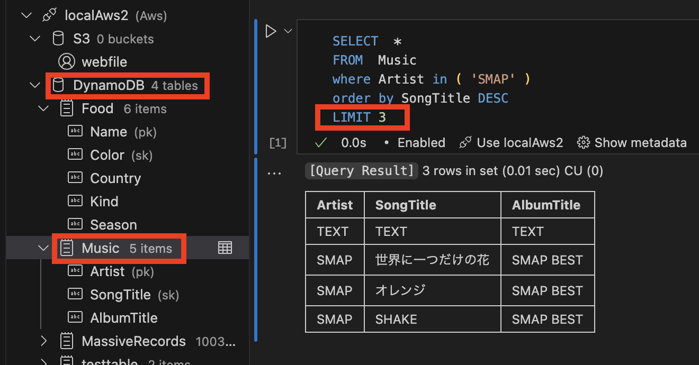
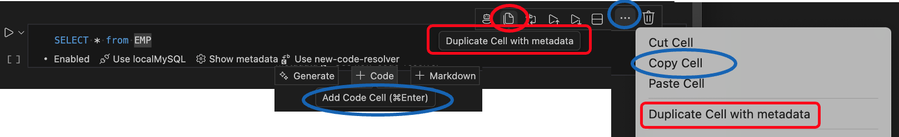
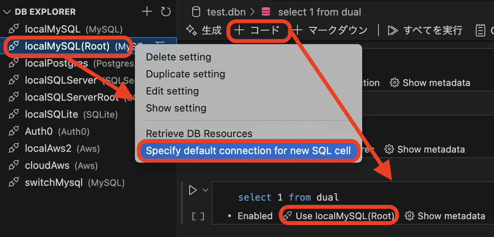

# Database Notebook

[English](README.md)

Database Notebook は、SQL・JavaScript/TypeScript・Markdown・実行結果を一つのNotebookファイルにまとめる VS Code 拡張機能です。DB・ログ・クラウドリソースを横断した場当たり的な調査を、保存・共有・再実行できる形に残せます。

## 何に役立つか

- **DB・ログ・クラウドリソースを横断した障害調査** — 本番/ステージング環境のDB、CloudWatchログ、AWSリソース(S3, SQS, DynamoDB, Secrets Manager, SSM)を同じNotebookから調査できます。調査全体が一つの再利用可能なファイルにまとまります。
- **SQL・JavaScript・Markdown・実行結果を一つのファイルで管理** — SQL・JavaScript/TypeScript・シェル・Markdownセルを混在させ、セル間で変数を共有できます。結果はHTMLまたはExcelとして出力可能です。詳細は [Database Notebook file examples](/docs/examples/databaseNotebook.md) を参照してください。
- **遅いSQLの診断と改善** — 実行計画、テーブル統計、インデックス、物理状態のシグナルをまとめて収集し、ボトルネック調査の根拠として利用できます。詳細は [Performance Tuning Guide](/docs/examples/performanceTuning.md) を参照してください。
- **保存済み接続を GitHub Copilot Chat / MCP クライアントから利用** — DB Explorerで設定した接続を、Copilot Chat(Agent mode)のAIツールとして、また外部のMCPクライアント(Claude Code, Claude Desktop, Cursor, ...)向けのスタンドアロンMCPサーバー経由でも利用できます。詳細は [AI Tools Usage Guide](/docs/examples/lmToolsUsageGuide.md) を参照してください。

## 3〜5分で試す Quickstart

外部データベースは不要です。ローカルの小さなSQLiteファイルだけで完結します。

1. 拡張機能をインストールします。
2. コマンドパレットから **`Database Notebook: Create SQLite Demo`** を実行します。小さなローカルSQLiteデータベース、それを指す接続設定、そしてすぐ実行できる `.dbn` Notebookが一括で作成されます。
3. Notebookを **Run All** で実行します。
4. クエリ結果と、生成されたグラフを確認します。
5. 結果パネルのツールバーから、結果をHTMLまたはExcelファイルとして保存します。
6. 準備ができたら、DB Explorerサイドパネルから自分の接続を作成し、Notebookをそちらに向けます。

## 対応データベース・リソース

MySQL, PostgreSQL, SQL Server, SQLite, Oracle, Redis, Memcached, AWS, Keycloak, Auth0, MQTT

## 詳細機能

- SQL・JavaScript/TypeScript (Node.js)・シェル/バッチスクリプト・Redis/Memcachedコマンド・Markdownセルを一つのNotebookファイルに混在させられる
  - シェルスクリプトセル(`shellscript`: bash/sh/zsh)は他のセルと同様に実行され、stdout/stderrをキャプチャします。Windowsバッチセル(`bat`)にも対応していますが実験的機能です(Windows上でのエンドツーエンド検証は未実施)
  - シェルスクリプト・バッチセルは、直前のセルまでの共有変数を `DB_NOTEBOOK_VAR_<name>` という環境変数として読み取れます(`$DB_NOTEBOOK_VAR_name` / `%DB_NOTEBOOK_VAR_name%`): [Use shared variables in shellscript/bat cells](/docs/examples/databaseNotebookVariableSharing.md#7-use-shared-variables-in-shellscript--bat-cells)
  - Redis/Memcachedコマンドセル(`redis`/`memcached`)は、保存済み接続に対して1セルにつき1つの生コマンドを実行し(例: `GET mykey`, `HGETALL myhash`)、SQLセルと同様にテーブル形式(RDH)の結果を返します(プレーンテキストではありません)
  - セル間で変数を共有でき、SQLセルの結果セットを後続のJavaScriptセルに渡してさらに処理することも可能
  - SQL → JavaScript → Markdown の一連の流れの完全な例: [Database Notebook file examples](/docs/examples/databaseNotebook.md#3-multi-language-flow-sql--javascript--markdown)
  - Redis/Memcachedコマンドセルの例: [Database Notebook Redis/Memcached command cell examples](/docs/examples/databaseNotebookRedisAndMemcached.md)
- Notebook・サイドパネル・パネルUIからデータベースへアクセス
- SQL実行モード
  - クエリ実行(デフォルト)
  - EXPLAINプラン実行(クエリプランを生成)
  - EXPLAIN ANALYZE実行(実際の実行時間と統計情報を表示)
- クエリ履歴管理
- Notebookセル間の変数共有
  - 共有変数を使った実践的なSQLの例(LIKE, IN, 完全一致): [Variable sharing – LIKE and IN examples](/docs/examples/databaseNotebookVariableSharing.md)
- ER図を[mermaid形式](https://mermaid.js.org/syntax/entityRelationshipDiagram.html)、または編集可能なdraw.io形式で生成
- CloudFormationスタックからMermaidまたは編集可能なdraw.io形式の図を生成
  - [CloudFormation Diagram Guide](/docs/examples/cloudFormationDiagram.md)
- スキーマ内の全テーブルの件数をカウント
- データベースのリソース名・コメントによるIntelliSense
- 結果セットの直感的な可視化
  - 比較キー(主キーまたはユニークキー)を使った差分表示
  - コードラベルリゾルバーによるラベル表示
  - 結果セットがルールに準拠しているかを検証
  - Excelファイル形式での出力
  - 記述統計量の生成
  - グラフ表示
- 変更を取り消すSQL文の作成・実行
- Notebookのエクスポート(HTMLファイル)
- ファイルプレビュー
  - CSVファイルプレビュー
  - Harファイルプレビュー
- MQTTクライアント
  - 直感的なpublish/subscribeインターフェース
  - Notebookから直接、購読したペイロードをSQLiteでクエリ
- SQLログの解析

### スクリーンショット

- 接続設定のセットアップ、サイドパネル経由でのMySQLへのアクセス

  - 

- Notebook経由でのMySQLへのアクセス( `Create a new blank Database Notebook` )

  - 

- Notebookセル間の変数共有

  - 

- Notebookのエクスポート(HTMLファイル)

  - 

- ER図作成

  - 

- SQL実行モード

  - クエリ実行(デフォルト)
  - EXPLAINプラン実行(クエリプランを生成)
  - EXPLAIN ANALYZE実行(実際の実行時間と統計情報を表示)
  - 

- SQL文のフォーマット

  - 

- スキーマ内の全テーブルの件数をカウント

  - 

- sqlファイルからDB Notebookを作成

  - 

- Notebook経由でのAWS(DynamoDB)へのアクセス

  - DB Notebook上でLIMIT句の件数を指定
  - 

- MQTTクライアント
  - 
  - [Database Notebook file MQTT examples](/docs/examples/databaseNotebookMQTT.md)

スクリーンショット(結果セットの直感的な可視化)(クリックして表示)

#### 比較キー(主キーまたはユニークキー)を使った差分表示

- 変更を取り消すSQL文の作成・実行

- 

#### コードラベルリゾルバーによるラベル表示( `Create a new blank Code label resolver` )

- 

#### レコードがルールに準拠しているかを検証( `Create a new blank DB record rule` )

- 

#### 記述統計量の生成

- 

スクリーンショット(サイドパネルからのKeycloakへのアクセス)(クリックして表示)

#### サイドパネルからKeycloakにアクセスし、ユーザー情報の変更を表示

- 

#### カラム内のJSON項目を展開して表示

- 

スクリーンショット(ファイルビューア)(クリックして表示)

#### CSVファイルビューア

- CSVファイルをプレビューすると、内容に応じて記述統計量が表示されます

- 

#### Harファイルビューア

- 

### SQLログ解析機能

Log Parse機能は、アプリケーションログを解析し、構造化されたSQL実行データを抽出します。

- [Log Parser Usage Guide](/docs/examples/log_parser_usage_guide.md)

## AI / MCP

- AIによるSQL文の評価

  - 

- Database Notebookの接続設定を、GitHub Copilot Chat(Agent mode)のAIツールとして利用
  - 接続の一覧・テスト、スキーマの調査、クエリ・トランザクションの実行、非SQLリソース(Redis, Memcache, MQTT, Keycloak, Auth0, AWS)のスキャン、`.dbn` Notebookの作成・編集まで — 既に保存済みの認証情報をそのまま再利用できます
  - [AI Tools Usage Guide](/docs/examples/lmToolsUsageGuide.md)
- スタンドアロンMCPサーバーを起動し、対応する外部MCPクライアント(Claude Code, Claude Desktop, Cursor, ...)からVS Code外でも同じ接続を利用可能
  - [MCP Server Usage Guide](/docs/examples/mcpServerUsageGuide.md)
  - ローカルMCPサーバーはChatGPT **Work** および Codex での動作を確認済みです。ChatGPTの通常の **Chat** モードでは、検証した環境ではこれらのツールが公開されません。クライアントごとの制限についてはUsage Guideを参照してください。

## リファレンス・サンプル

- [Database Notebook file examples](/docs/examples/databaseNotebook.md)
- [Database Notebook file chart examples](/docs/examples/databaseNotebookChart.md)
- [Database Notebook file Javascript cell examples](/docs/examples/databaseNotebookJs.md)
- [Database Notebook file MQTT examples](/docs/examples/databaseNotebookMQTT.md)
- [Database Notebook file Variable sharing – SQL examples (LIKE / IN / exact match)](/docs/examples/databaseNotebookVariableSharing.md)
- [Performance Tuning Guide](/docs/examples/performanceTuning.md)
- [Log Parser Usage Guide](/docs/examples/log_parser_usage_guide.md)
- [Connecting to SQL Server with Entra ID (Azure AD) authentication](/docs/examples/entraIdAuthentication.md)
- [Using Database Notebook's AI Tools from GitHub Copilot Chat](/docs/examples/lmToolsUsageGuide.md)
- [Using Database Notebook's AI Tools via a Standalone MCP Server](/docs/examples/mcpServerUsageGuide.md)

### Tips

1. VS Code標準の `Copy Cell` や `+ Code` / `Add Code Cell` の代わりに、`Duplicate Cell with Metadata` の使用をおすすめします。
   このアクションはセルの内容だけでなく、データベース接続設定やResultSetの装飾オプションといった関連メタデータもコピーするため、これらを再設定することなく新しいセルを追加できます。
   - 
1. Notebookに新しいSQLセルを追加するたびに使われる、デフォルトの接続定義を指定できます
   - 

## キーボードショートカット

このエディタは、メニューの Code > Settings > Keyboard Shortcuts、または Preferences: Open Keyboard Shortcuts コマンド(⌘K ⌘S)から開けます。

| コマンド                   | キーバインド | 条件(When)                                                                                              | ソース            |
| :------------------------ | :---------: | :------------------------------------------------------------------------------------------------ | :---------------- |
| セルをスキップとしてマーク/解除  | ctrl+alt+s  | notebookType == 'database-notebook-type' && notebookCellListFocused && notebookCellType == 'code' | Database notebook |
| 使用する接続を指定 | ctrl+alt+c  | notebookType == 'database-notebook-type' && notebookCellListFocused && cellLangId == 'sql'        | Database notebook |
| Notebook: セル実行  | ctrl+enter  | -                                                                                                 | System (default)  |

## 必要要件

- node.js >= 18

## 推奨拡張機能

ER図をMermaid形式で生成した場合(もう一方の選択肢は編集可能なdraw.io形式です)、プレビュー用Notebook内に表示されます。
これを可視化するには、"[Markdown Preview Mermaid Support](https://marketplace.visualstudio.com/items?itemName=bierner.markdown-mermaid)" 拡張機能を併用することをおすすめします。

## 🎁 Donate

