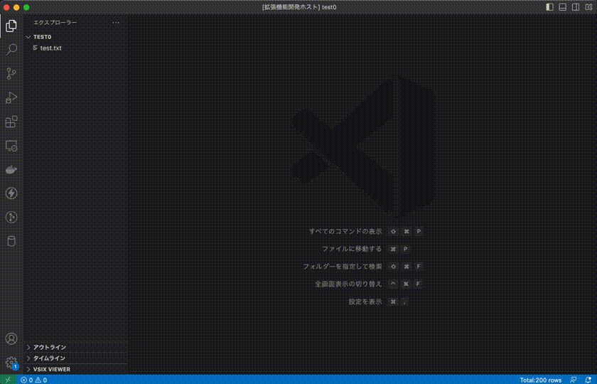

# Database Notebook

Database Notebook is a Visual Studio Code extension that allows access to various databases through the VSCODE Notebook interface.

## Features

- Various databases accesss in Notebooks, Sidebars and panels UI
  - MySQL, Postgres, Redis, AWS
- Run & stop SQL, JavaScript code in node.js
- Variable sharing between notebook cells
- ER diagram creation in [mermaid format](https://mermaid.js.org/syntax/entityRelationshipDiagram.html)
- Provide IntelliSense using DB resource names and coments
- Convenient visualization of result sets
  - Difference display using comparison key (Primary or Unique key)
  - Label display using code label resolver
  - Display of record rule validation errors
  - Output in Excel file format

## Getting started

- Setup connection settings
- Access to database
  - through the SidePanel
  - through the Notebook

## Examples

- Setup connection settings, access to Mysql through the side-panel
  - 

## Requirements

- node.js >= 14.14

## Recommended Extensions

The ER diagram is output in mermaid format.
It is recommended to use the "[Markdown Preview Mermaid Support](https://marketplace.visualstudio.com/items?itemName=bierner.markdown-mermaid)" extension together to visualize it.
