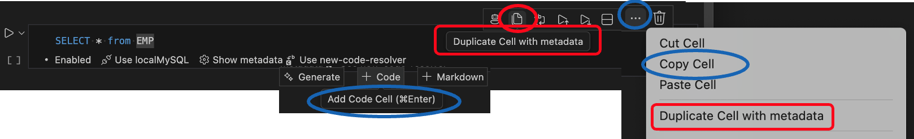
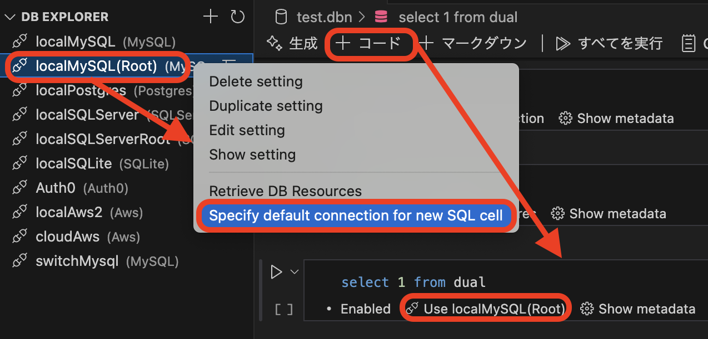

# Database Notebook

Database Notebook is a Visual Studio Code extension that allows access to various databases through the VSCODE Notebook interface.

It also provides a CSV and Har file preview feature.

## Features

- Access various databases through Notebooks, Sidebars, and panel UIs
  - MySQL, PostgreSQL, SQL Server, SQLite, Redis, Memcached, AWS, Keycloak, Auth0, MQTT
- Execute & stop SQL, JavaScript code in node.js
- Execute SQL mode
  - Execute query (Default)
  - Execute explain plan (Generates a query plan).
  - Execute explain analyze (Displays actual execution time and statistics)
- SQL history management
- Variable sharing between notebook cells
  - See practical SQL examples using shared variables (LIKE, IN, exact match):
    [Variable sharing – LIKE and IN examples](/docs/examples/databaseNotebookVariableSharing.md)
- ER diagram creation in [mermaid format](https://mermaid.js.org/syntax/entityRelationshipDiagram.html)
- Count all tables in the schema
- Provide IntelliSense with database resource names and comments
- Intuitive visualization of result sets
  - Difference display using comparison key (Primary or Unique key)
  - Label display using code label resolver
  - Verify result sets comply with a rule.
  - Output in Excel file format
  - Generate descriptive statistics
  - Support graphs
- Create and execute SQL statements to undo changes
- Export notebook as an HTML file
- File preview
  - CSV file preview
  - Har file preview
- Evaluate SQL statements with AI
- Generate SQL queries with AI
- MQTT Client
  - Intuitive publish/subscribe interface
  - Query subscribed payloads using SQLite directly from the notebook

## Screenshots

- Setup connection settings, access to Mysql through the Side-panel

  - 

- Access to Mysql through the Notebook ( `Create a new blank Database Notebook` )

  - 

- Execute SQL mode

  - Execute query (Default)
  - Execute explain plan (Generates a query plan).
  - Execute explain analyze (Displays actual
  - 

- Variable sharing between notebook cells

  - 

- ER diagram creation in mermaid format

  - 

- Format SQL statement

  - 

- Count all tables in the schema

  - 

- Export notebook as an HTML file

  - 

- Create DB Notebook from an sql file

  - 

- Evaluate SQL statements with AI

  - 

- Generate SQL queries with AI

  - 

- Access to Aws( DynamoDB ) through the Notebook

  - On the DB Notebook, specify the number of counts in the LIMIT clause
  - 

- MQTT Client
  - 
  - [Database Notebook file MQTT examples](/docs/examples/databaseNotebookMQTT.md)

Screenshots ( Intuitive visualization of result sets ) ( Click here )

### Difference display using comparison key (Primary or Unique key)

- Create and execute SQL statements to undo changes

- 

### Label display using code label resolver ( `Create a new blank Code label resolver` )

- 

### Verify records comply with a rule ( `Create a new blank DB record rule` )

- 

### Generate descriptive statistics

- 

Screenshots ( Access to the Keycloak from the side panel ) ( Click here )

### Access to the Keycloak from the side panel to display changes in user information.

- 

### Expand and display JSON items in columns.

- 

Screenshots ( File viewer ) ( Click here )

### Csv file viewer

- After previewing the CSV file, descriptive statistics were displayed according to its content.

- 

### Har file viewer

- 

## Tips

1. Instead of using VS Code’s built-in `Copy Cell` or `+ Code` / `Add Code Cell`, I recommend using `Duplicate Cell with Metadata`.
This action copies not only the cell content, but also all associated metadata—such as database connection settings and ResultSet decoration options—so you can add a new cell without reconfiguring these settings.
   - 
1. You can specify a default connection definition each time you add a new SQL cell to the notebook
   - 

## Examples

- [Database Notebook file examples](/docs/examples/databaseNotebook.md)
- [Database Notebook file chart examples](/docs/examples/databaseNotebookChart.md)
- [Database Notebook file Javascript cell examples](/docs/examples/databaseNotebookJs.md)
- [Database Notebook file MQTT examples](/docs/examples/databaseNotebookMQTT.md)
- [Database Notebook file Variable sharing – SQL examples (LIKE / IN / exact match)](/docs/examples/databaseNotebookVariableSharing.md)

## Keyboard shortcuts

You can open this editor by going to the menu under Code > Settings > Keyboard Shortcuts or by using the Preferences: Open Keyboard Shortcuts command (⌘K ⌘S).

| Command                   | Keybindings | When                                                                                              | Source            |
| :------------------------ | :---------: | :------------------------------------------------------------------------------------------------ | :---------------- |
| Mark cell as skip or not  | ctrl+alt+s  | notebookType == 'database-notebook-type' && notebookCellListFocused && notebookCellType == 'code' | Database notebook |
| Specify connection to use | ctrl+alt+c  | notebookType == 'database-notebook-type' && notebookCellListFocused && cellLangId == 'sql'        | Database notebook |
| Notebook: cell execution  | ctrl+enter  | -                                                                                                 | System (default)  |

## Requirements

- node.js >= 18

## Recommended Extensions

The ER diagram is output in mermaid format.
It is recommended to use the "[Markdown Preview Mermaid Support](https://marketplace.visualstudio.com/items?itemName=bierner.markdown-mermaid)" extension together to visualize it.

## 🎁 Donate

