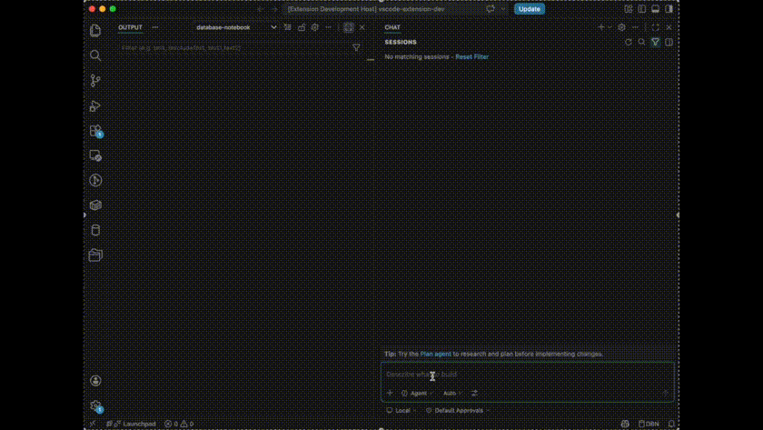

# Using Database Notebook's AI Tools from GitHub Copilot Chat

Database Notebook registers a set of tools with VS Code's built-in Language Model Tool API
(`vscode.lm.registerTool`), so GitHub Copilot Chat's **Agent mode** can list your connections,
inspect schemas, run queries, and even create or edit `.dbn` notebook files — using the exact
same connections you've already configured in the DB Explorer, without you copying credentials
anywhere else.

This page explains how to turn a connection on for AI use, how to invoke the tools from chat, and
shows an example prompt / tool input / result for every tool currently available.

## TOC

- 1. [Overview](#1-overview)
- 2. [Prerequisites](#2-prerequisites)
  - 2.1. [Enable a connection for AI tool use](#21-enable-a-connection-for-ai-tool-use)
- 3. [How to invoke a tool](#3-how-to-invoke-a-tool)
- 4. [Confirmation dialogs](#4-confirmation-dialogs)
- 5. [Tool reference](#5-tool-reference)
  - 5.1. [List Database Connections — `#listDbConnections`](#51-list-database-connections--listdbconnections)
  - 5.2. [Test Database Connection — `#testDbConnection`](#52-test-database-connection--testdbconnection)
  - 5.3. [Get Database Schema — `#getDbSchema`](#53-get-database-schema--getdbschema)
  - 5.4. [Run Database Query — `#runDbQuery`](#54-run-database-query--rundbquery)
  - 5.5. [Run Database Transaction — `#runDbTransaction`](#55-run-database-transaction--rundbtransaction)
  - 5.6. [Scan Database Resource — `#scanDbResource`](#56-scan-database-resource--scandbresource)
  - 5.7. [Create Database Notebook — `#createDbNotebook`](#57-create-database-notebook--createdbnotebook)
  - 5.8. [Edit Database Notebook — `#editDbNotebook`](#58-edit-database-notebook--editdbnotebook)
- 6. [Putting it together: a chained example](#6-putting-it-together-a-chained-example)
- 7. [Troubleshooting](#7-troubleshooting)

## 1. Overview

These tools are only reachable from **VS Code's own built-in Copilot Chat, in Agent mode** — they
are not an MCP server, so they aren't visible to Claude Code, Copilot CLI, or any other MCP client.
They run entirely in-process inside the extension, which is what lets them reuse a connection's
already-saved credentials instead of asking you to configure anything a second time.

| Tool | `#` reference | What it does |
| --- | --- | --- |
| List Database Connections | `#listDbConnections` | Lists the connections available to AI tools |
| Test Database Connection | `#testDbConnection` | Live connectivity check for one named connection |
| Get Database Schema | `#getDbSchema` | Table DDL / resource structure for one connection |
| Run Database Query | `#runDbQuery` | Runs one SQL statement |
| Run Database Transaction | `#runDbTransaction` | Runs several SQL statements as one all-or-nothing transaction |
| Scan Database Resource | `#scanDbResource` | Searches a non-SQL resource (Redis, Memcache, MQTT, Keycloak, Auth0, AWS S3/SQS/CloudWatch) |
| Create Database Notebook | `#createDbNotebook` | Creates a new `.dbn` notebook from cells or raw SQL |
| Edit Database Notebook | `#editDbNotebook` | Inserts/replaces/deletes cells, or updates a cell's metadata/source, in an existing `.dbn` notebook |

## 2. Prerequisites

- VS Code with GitHub Copilot Chat installed and signed in, using **Agent mode** (the mode picker
  in the Chat view — sometimes labeled "Agent" or "Local").
- At least one connection configured in the DB Explorer, with AI tool access turned on for it (see
  below). Connections are **opt-in**: a connection you haven't explicitly enabled is invisible to
  every one of these tools, exactly as if it didn't exist.

### 2.1. Enable a connection for AI tool use

1. Open the connection in the DB Explorer's connection settings form (create, edit, or duplicate).
2. Find the **AI Tools** field and check **"Allow AI tools (e.g. Copilot Chat) to check and query
   this connection"**.
3. Save the connection.

This flag defaults to **off**, including for connections you created before this feature existed —
so if a connection you expect to see doesn't show up in `#listDbConnections`, this is the first
thing to check.

## 3. How to invoke a tool

You don't have to remember any tool names — Copilot Chat's Agent mode reads each tool's
description and decides on its own when to call one, so a plain question is usually enough:

> Which database connections do I have available for you to use?

If Copilot doesn't pick the tool you expect (or you want to force a specific one), reference it
explicitly with `#`:

> #listDbConnections

Both forms end up calling the exact same tool with the exact same input — `#name` just skips
Copilot's own "should I call a tool here?" decision.

## 4. Confirmation dialogs

Anything that can change data always asks you to confirm first, showing exactly what's about to
run:

- `#runDbQuery` asks for confirmation for anything that isn't a plain read (`SELECT`/`EXPLAIN`/
  `SHOW`/...), and — because Database Notebook can't force a read-only session on SQL Server —
  **every** statement on a SQL Server connection, reads included.
- `#runDbTransaction` always asks, regardless of what the statements are.
- `#editDbNotebook` always asks, regardless of which operations are in the batch.
- `#listDbConnections`, `#testDbConnection`, `#getDbSchema`, `#scanDbResource`, and
  `#createDbNotebook` never ask — they either can't change existing data (the first four), or
  `#createDbNotebook` limits its own blast radius by refusing to overwrite anything that already
  exists (see [5.7](#57-create-database-notebook--createdbnotebook)).

Each dialog offers **"Allow Once"** and **"Allow in this Session"** (labels may vary slightly by
VS Code version) — see [Troubleshooting](#6-troubleshooting) for an important gotcha with the
second option.

## 5. Tool reference

The examples below all use the same running example as
[the main Database Notebook examples page](./databaseNotebook.md): a `customer` table
(`customer_no`, `name`, `age`) and an `order`/`order_detail` pair, on a connection named
`localMysql`. A second connection, `prodMysql`, is marked read-only; `awsProd` is an AWS
connection configured for DynamoDB/S3/CloudWatch Logs; `localRedis` and `mqttBroker` round out the
non-SQL examples.

### 5.1. List Database Connections — `#listDbConnections`

Takes no input. Returns name, DB type, environment, and a short type-specific detail for every
AI-enabled connection — no credentials.

**Prompt(EN)**

`What database connections do I have available?`

**Prompt(JA)**

`利用可能な接続定義一覧は?`

**Tool input**

Nothing

**Result**

```
Available database connections
- localMysql (MySQL, env: local)
- prodMysql (MySQL, env: production, read-only)
- awsProd (Aws, env: production, services: DynamoDB, S3, Cloudwatch)
- localRedis (Redis, env: local)
- mqttBroker (Mqtt, env: local, protocol: mqtt)
```

If nothing is enabled yet, the tool says so instead of returning an empty list:

```
No connections are currently available to AI tools. The user needs to enable at least one connection for AI access in Database Notebook's connection settings.
```

### 5.2. Test Database Connection — `#testDbConnection`

Actually attempts to connect right now — not a guess from static config. Use this before trusting
an answer like "is prod up?".

**Prompt(EN)**

`Is the prodMysql connection reachable right now?`

**Prompt(JA)**

`接続定義 prodMysql で繋がる?`

**Tool input**

```json
{ "connectionName": "prodMysql" }
```

**Result**

```
✅ Connection "prodMysql" is reachable.
```

If the name doesn't match exactly (or the connection isn't AI-enabled), you get the same "not
found" shape every tool uses, plus the list of names that *are* usable:

```
❌ No connection named "prod-mysql" was found.
Available connections: localMysql, prodMysql, awsProd, localRedis, mqttBroker
```

### 5.3. Get Database Schema — `#getDbSchema`

Returns `CREATE TABLE` DDL for SQL connections, or a type-appropriate summary for everything else
(AWS resource list, Redis key counts per DB index, MQTT subscriptions, Keycloak realms, ...).
`connectionName` is the only required field; `schemaName`/`tableName` (SQL) or
`serviceType`/`resourceName` (AWS) narrow the result.

**Prompt(EN)**

`Show me the structure of the customer table on localMysql`

**Prompt(JA)**

`localMysql の customer テーブルのスキーマ定義を教えて`

**Tool input**

```json
{ "connectionName": "localMysql", "tableName": "customer" }
```

**Result**

```sql
CREATE TABLE `customer` (
  `customer_no` int NOT NULL,
  `name` varchar(100) DEFAULT NULL,
  `age` int DEFAULT NULL,
  PRIMARY KEY (`customer_no`)
) ENGINE=InnoDB DEFAULT CHARSET=utf8mb4
```

The same tool against an AWS connection returns a different shape entirely:

**Prompt**

> What DynamoDB tables does awsProd have access to?

**Tool input**

```json
{ "connectionName": "awsProd", "serviceType": "DynamoDB" }
```

**Result**

```
--- Tables (1 table) ---
orders_table (
    order_no String PARTITION KEY,
    created_at Number SORT KEY

    GSI CustomerIndex (
        customer_no String PARTITION KEY
    )

    ATTRIBUTES (
        order_no String,
        created_at Number,
        customer_no String,
        amount Number
    )
)
```

### 5.4. Run Database Query — `#runDbQuery`

Runs one SQL statement and returns the result. Prefer this for a single `SELECT`; use
`#runDbTransaction` instead for several statements that must succeed or fail together.

**Prompt(EN)**

```
Run this against localMysql: SELECT customer_no, age FROM customer WHERE age IN (10, 20, 30) ORDER BY customer_no
```

**Prompt(JA)**

```
localMysql の接続定義で以下のSQLを発行して
SELECT customer_no, age FROM customer WHERE age IN (10, 20, 30) ORDER BY customer_no
```

**Tool input**

```json
{
  "connectionName": "localMysql",
  "sql": "SELECT customer_no, age FROM customer WHERE age IN (10, 20, 30) ORDER BY customer_no"
}
```

**Result**

```
customer_no age
7566        10
7698        30
7782        20
```

A write/DDL statement is never run silently — you'll see a confirmation dialog first:

**Prompt(EN)**

`On localMysql, set customer 7698's age to 31`

**Prompt(JA)**

`localMysql の接続定義を利用して customer 7698 の age を 31 に更新して`

**Tool input**

```json
{ "connectionName": "localMysql", "sql": "UPDATE customer SET age = 31 WHERE customer_no = 7698" }
```

**Confirmation dialog**

> **Run SQL on "localMysql"?**
>
> This looks like a write/DDL statement. Review it before running against **localMysql**:
>
> ```sql
> UPDATE customer SET age = 31 WHERE customer_no = 7698
> ```

**Result (after confirming)**

```
OK. 1 row(s) affected.
```

### 5.5. Run Database Transaction — `#runDbTransaction`

Runs several statements as one atomic transaction, in order, stopping at the first failure.
`transactionControlType` defaults to `rollbackOnError`; `alwaysCommit` keeps partial writes after a
failure, `alwaysRollback` is a dry run. Always asks for confirmation.

**Prompt(EN)**

> As one transaction on localMysql: insert a new order for customer 7566 dated today for 300, then set that customer's age to 11

**Prompt(JA)**

```
localMysql の接続定義を利用して、後続の更新内容を1トランザクションで実施して
- order テーブルに「customer: 7566, dated: today, amount: 300」で新規レコード追加
- customer テーブルの該当レコードの age を 11 に更新
```

**Tool input**

```json
{
  "connectionName": "localMysql",
  "statements": [
    "INSERT INTO order1 (customer_no, order_date, amount) VALUES (7566, '2026-07-19', 300)",
    "UPDATE customer SET age = 11 WHERE customer_no = 7566"
  ],
  "transactionControlType": "rollbackOnError"
}
```

**Confirmation dialog**

> **Run 2-statement transaction on "localMysql"?**
>
> This runs all statements below as one transaction against **localMysql**.
>
> **Transaction mode:** `rollbackOnError` -- Commit only if every statement succeeds; roll back
> everything if any statement fails. (default, recommended)
>
> 1. ```sql
>    INSERT INTO order1 (customer_no, order_date, amount) VALUES (7566, '2026-07-19', 300)
>    ```
> 2. ```sql
>    UPDATE customer SET age = 11 WHERE customer_no = 7566
>    ```

**Result (after confirming)**

```
✅ All 2 statement(s) completed (rollbackOnError).

Statement 1/2: INSERT INTO order1 (customer_no, order_date, amount) VALUES (7566, '2026-07-19', 300)
OK. 1 row(s) affected.

Statement 2/2: UPDATE customer SET age = 11 WHERE customer_no = 7566
OK. 1 row(s) affected.
```

### 5.6. Scan Database Resource — `#scanDbResource`

For connections that can't run SQL (Redis, Memcache, MQTT, Keycloak, Auth0, or AWS S3/SQS/
CloudWatch Logs). Fill in exactly **one** of the resource-specific nested objects
(`redis`/`memcache`/`mqtt`/`awsS3`/`awsSqs`/`awsCloudWatchLogGroup`/`awsCloudWatchLogStream`/
`keycloak`/`auth0`) matching the connection's type.

**Prompt(EN)**

> Scan localRedis for keys matching session:*

**Prompt(JA)**

> 接続定義 localRedis を利用して キー session:* に該当する内容を教えて

**Tool input**

```json
{
  "connectionName": "localRedis",
  "limit": 20,
  "redis": { "dbIndex": 0, "keyGlob": "session:*" }
}
```

**Result**

```
key                   type ttl    val
session:7566-a1b2c3d4 hash 1m 58s {"customerNo":7566,"loginAt":"2026-07-19T09:00:00Z"}
session:7698-e5f6a7b8 hash 5m 40s {"customerNo":7698,"loginAt":"2026-07-19T09:02:11Z"}
```

### 5.7. Create Database Notebook — `#createDbNotebook`

Creates a new `.dbn` file from a cell list, or from raw multi-statement SQL text (split into one
SQL cell per statement, same as the "Create Notebook from SQL" command), and opens it. Refuses to
overwrite an existing file or an already-open notebook — modify those with `#editDbNotebook`
instead — so there's nothing to confirm here.

**Prompt(EN)**

> Create a notebook at reports/customer_age_report.dbn with a title cell and a query against localMysql for customers aged 10, 20, or 30

**Prompt(JA)**

> reports/customer_age_report.dbn にノートブックを作成し、タイトルセルと、localMysql に対する「年齢が 10、20、または 3 の顧客」を取得するクエリを含めてください。

**Tool input**

```json
{
  "notebookPath": "reports/customer_age_report.dbn",
  "connectionName": "localMysql",
  "cells": [
    { "kind": "markup", "value": "# Customer age report\n\nGenerated from Copilot Chat." },
    {
      "kind": "code",
      "language": "sql",
      "value": "SELECT customer_no, age FROM customer WHERE age IN (10, 20, 30) ORDER BY customer_no"
    }
  ]
}
```

**Result**

```
✅ Created "/Users/you/project/reports/customer_age_report.dbn" with 2 cell(s) (markdown, sql).
```

The new notebook opens in the editor immediately so you can review or run it.

### 5.8. Edit Database Notebook — `#editDbNotebook`

Applies an ordered batch of operations — `insertCells`, `replaceCells`, `deleteCells`,
`updateCellMetadata` (merges fields, doesn't wipe out settings it doesn't know about, like chart
config), or `updateCellSource` — to an existing `.dbn` file. Cell index/range values in operation N
are interpreted **after** operations 1..N-1 in the same call have already applied. Always asks for
confirmation, listing every planned operation, and applies none of them if any single operation
turns out to be invalid.

**Prompt(EN)**

> In reports/customer_age_report.dbn, add a cell at the end that counts all customers on localMysql

**Prompt(JA)**

> reports/customer_age_report.dbn にあるノートブックの最後にセルを追加し、localMysql に対して全顧客数を数えるクエリを追加してください

**Tool input**

```json
{
  "notebookPath": "reports/customer_age_report.dbn",
  "operations": [
    {
      "insertCells": {
        "index": 2,
        "cells": [
          {
            "kind": "code",
            "language": "sql",
            "value": "SELECT COUNT(*) AS total FROM customer",
            "metadata": { "connectionName": "localMysql" }
          }
        ]
      }
    }
  ]
}
```

**Confirmation dialog**

> **Apply 1 edit(s) to "reports/customer_age_report.dbn"?**
>
> This edits your notebook file directly. Review the planned change(s) to
> **reports/customer_age_report.dbn** below:
>
> 1. **Insert** 1 cell(s) at index 2: [sql] "SELECT COUNT(*) AS total FROM customer"

**Result (after confirming)**

```
✅ Applied 1 edit(s) to "/Users/you/project/reports/customer_age_report.dbn".
1. insertCells: 1 cell(s) at index 2
```

The notebook is left **unsaved** after the edit — one more chance to look it over (or hit Undo)
before it's written to disk.

## 6. Putting it together: a chained example

The sections above show one tool at a time, but Agent mode's real value shows up when a single
plain-language request makes Copilot call **several tools back-to-back on its own** — you don't
invoke `#listDbConnections`, then `#getDbSchema`, then `#runDbQuery` yourself; you ask once, and the
model figures out the tool order and each tool's input from what it learned in the previous step.

**Prompt(EN)**

> If there's a local Postgres connection available, list its tables, then run a sample query
> against whichever table has an age column, and show me the result as a table.

**Prompt(JA)**

> ローカル環境向けのPostgresのDB接続定義があれば、それを使って存在するテーブルのリストを取得し、
> 年齢列をもつテーブルに対しデータをサンプリングするクエリを発行し、結果をテーブル形式で提示して。

**Step 1 — find the connection (`#listDbConnections`)**

Tool input:

```json
{}
```

Result:

```
Available database connections
- localMysql (MySQL, env: local)
- localPostgres (PostgreSQL, env: local)
- prodMysql (MySQL, env: production, read-only)
- awsProd (Aws, env: production, services: DynamoDB, S3, Cloudwatch)
- localRedis (Redis, env: local)
- mqttBroker (Mqtt, env: local, protocol: mqtt)
```

Copilot picks out `localPostgres` from this list on its own — nothing in the prompt named it
directly.

**Step 2 — find a table with an age column (`#getDbSchema`)**

Tool input (no `tableName` yet — Copilot doesn't know which table has `age` until it sees the whole
schema):

```json
{ "connectionName": "localPostgres" }
```

Result:

```sql
CREATE TABLE "customer" (
  "customer_no" integer NOT NULL,
  "name" varchar(100),
  "age" integer,
  PRIMARY KEY ("customer_no")
)

CREATE TABLE "order" (
  "order_no" integer NOT NULL,
  "customer_no" integer,
  "order_date" date,
  "amount" numeric(10,2),
  PRIMARY KEY ("order_no")
)

CREATE TABLE "order_detail" (
  "order_no" integer NOT NULL,
  "line_no" integer NOT NULL,
  "item" varchar(100),
  "qty" integer,
  PRIMARY KEY ("order_no", "line_no")
)
```

Copilot spots `age` on `customer` and moves straight to sampling it — no follow-up question needed.

**Step 3 — sample the table (`#runDbQuery`)**

Tool input:

```json
{
  "connectionName": "localPostgres",
  "sql": "SELECT customer_no, name, age FROM customer LIMIT 20"
}
```

This is a plain `SELECT`, so — unlike a write/DDL statement — it runs without a confirmation dialog.

Result:

```
customer_no name    age
7566        Alice   10
7698        Bob     30
7782        Carol   20
```

Copilot then explains the sample in its own words. The whole exchange above is **one chat turn**:
you asked once, in plain language, and the model chose which three tools to call, in what order,
and with what input — purely from what each previous result told it.



## 7. Troubleshooting

- **A connection you expect doesn't show up / a tool says "no connection named X was found" even
  though X exists** — check the **AI Tools** checkbox on that connection ([2.1](#21-enable-a-connection-for-ai-tool-use)).
  A connection that exists but isn't enabled is reported identically to one that doesn't exist at
  all, so AI tools can never discover connections you haven't explicitly allowed.
- **A confirmation dialog stops appearing, even for a query you'd expect to trigger one** — check
  whether you previously clicked **"Allow in this Session"** on that tool. That grant applies to
  the whole VS Code/extension-host process for as long as it stays open — not just the current
  chat conversation — and isn't cleared by starting a new chat or running
  `Chat: Reset Tool Confirmations` (that command only clears persisted "Always Allow"/"Allow in
  this Workspace" grants). Reloading the VS Code window clears it. While testing, prefer
  **"Allow Once"** so each call's confirmation behavior stays visible.
- **Copilot answers from general knowledge instead of calling a tool** — rephrase to make it clear
  you want the *current, live* answer ("check right now", "actually run this"), or reference the
  tool explicitly with `#toolName` ([3](#3-how-to-invoke-a-tool)).
- **These tools don't show up outside VS Code's own Copilot Chat** (e.g. in Claude Code, Copilot
  CLI, or another editor) — expected. They're registered through VS Code's Language Model Tool
  API, which only Copilot Chat's Agent mode inside VS Code consumes; this extension does not run a
  standalone MCP server.
