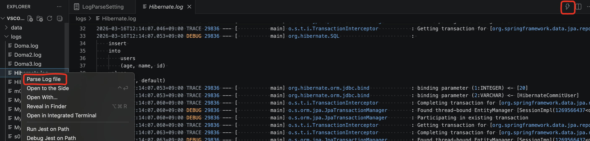
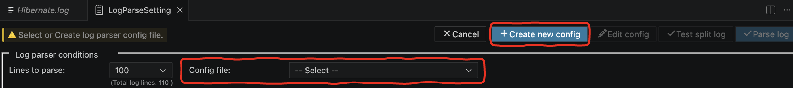
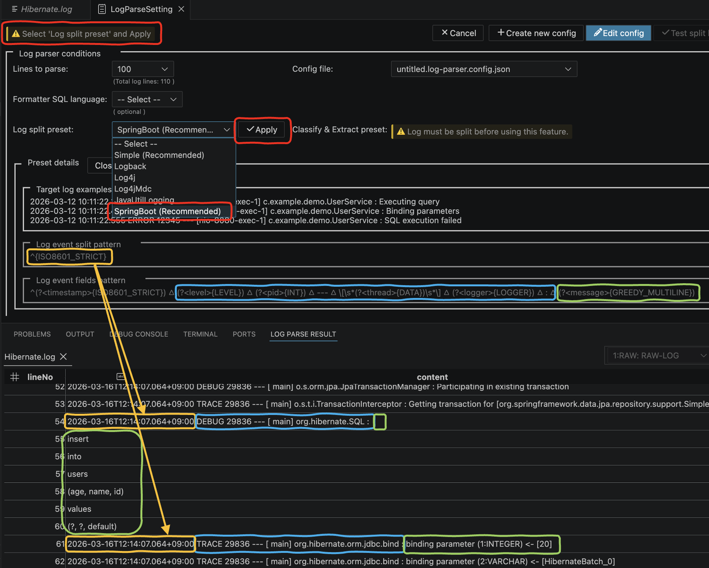
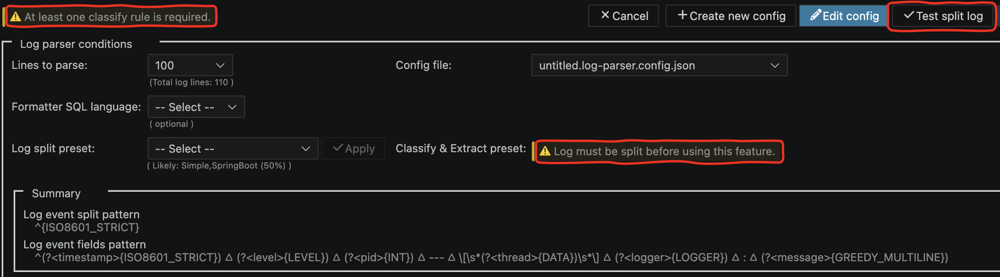
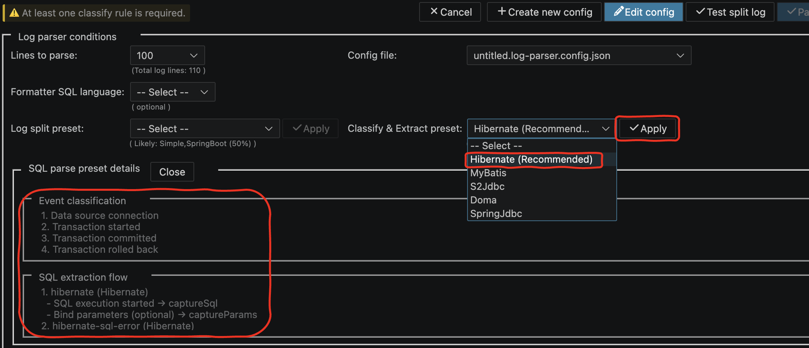
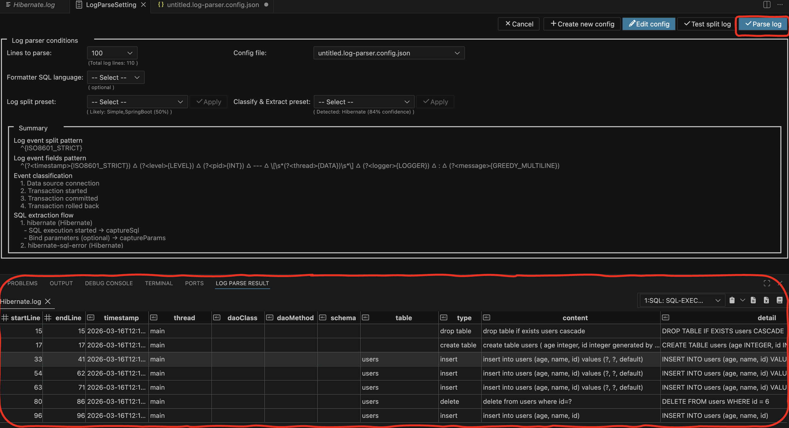
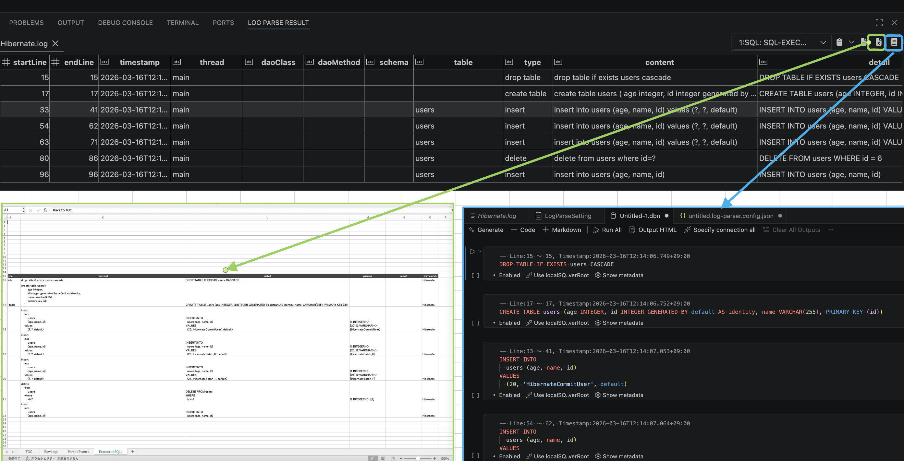

# Log Parser Usage Guide

This document explains how to use the `Log Parser` feature and how it works internally.

---

## Overview

This extension parses application logs (e.g. Spring Boot + Hibernate) and extracts structured SQL execution data.

### Processing Pipeline

```
split → (expand message) → classify → extract → build-sql
```

| Step | Description |
|------|------------|
| split | Raw log is divided into logical log events |
| expand message | Expand a single log event containing multiple logical messages into multiple events, duplicating metadata so each can be classified independently |
| classify | Each event is classified (SQL, TX, NORMAL, etc.) |
| extract | SQL statements, parameters, and metadata are extracted |
| build-sql | Final SQL is reconstructed with bound parameters |

---

## Usage Flow

### 1. Parse Log File from Context Menu



- Open a log file in the editor
- Right-click → **Parse Log file**

---

### 2. Open Log Parse Setting Panel



- The **Log Parse Setting Panel** is displayed
- This panel controls all parsing behavior
- Select or Create Config File
  - Select an existing config file or create a new one

---

### 3. Choose Log Split Preset



- Select a Log split preset
- Review:
  - Target log examples
  - Event split pattern
  - Field extraction pattern

---

### 4. Execute "Test split log" (Important)



- Click **Test split log**

This step is mandatory:
- Enables classification & extraction presets
- Generates structured log events

---

### 5. Select 'Classify & Extract' Preset



- Select classification & extraction preset

---

### 6. Parse Log



- Click **Parse log**

---

### 7. Generate report in Excel and DBN file.



---

## Example Result

Sample `SpringBoot x Hibernate` log

### 1. RAW LOG

```log
2026-03-16T12:14:07.045+09:00  INFO 29836 --- [           main] com.example.demo.DemoApplication         : ===== HIBERNATE COMMIT TEST =====
2026-03-16T12:14:07.045+09:00 DEBUG 29836 --- [           main] o.s.orm.jpa.JpaTransactionManager        : Creating new transaction with name [com.example.demo.HibernateService.commitTransactionTest]: PROPAGATION_REQUIRED,ISOLATION_DEFAULT
2026-03-16T12:14:07.045+09:00 DEBUG 29836 --- [           main] o.s.orm.jpa.JpaTransactionManager        : Opened new EntityManager [SessionImpl(1269566437<open>)] for JPA transaction
2026-03-16T12:14:07.045+09:00 DEBUG 29836 --- [           main] o.s.orm.jpa.JpaTransactionManager        : Exposing JPA transaction as JDBC [org.springframework.orm.jpa.vendor.HibernateJpaDialect$HibernateConnectionHandle@368d51ca]
2026-03-16T12:14:07.066+09:00 TRACE 29836 --- [           main] o.s.t.i.TransactionInterceptor           : Getting transaction for [org.springframework.data.jpa.repository.support.SimpleJpaRepository.delete]
2026-03-16T12:14:07.067+09:00 TRACE 29836 --- [           main] o.s.t.i.TransactionInterceptor           : Completing transaction for [org.springframework.data.jpa.repository.support.SimpleJpaRepository.delete]
2026-03-16T12:14:07.067+09:00 TRACE 29836 --- [           main] o.s.t.i.TransactionInterceptor           : Completing transaction for [com.example.demo.HibernateService.commitTransactionTest]
2026-03-16T12:14:07.067+09:00 DEBUG 29836 --- [           main] o.s.orm.jpa.JpaTransactionManager        : Initiating transaction commit
2026-03-16T12:14:07.067+09:00 DEBUG 29836 --- [           main] o.s.orm.jpa.JpaTransactionManager        : Committing JPA transaction on EntityManager [SessionImpl(1269566437<open>)]
2026-03-16T12:14:07.070+09:00 DEBUG 29836 --- [           main] org.hibernate.SQL                        : 
    delete 
    from
        users 
    where
        id=?
2026-03-16T12:14:07.070+09:00 TRACE 29836 --- [           main] org.hibernate.orm.jdbc.bind              : binding parameter (1:INTEGER) <- [6]
2026-03-16T12:14:07.071+09:00 DEBUG 29836 --- [           main] o.s.orm.jpa.JpaTransactionManager        : Closing JPA EntityManager [SessionImpl(1269566437<open>)] after transaction
2026-03-16T12:14:07.071+09:00  INFO 29836 --- [           main] com.example.demo.DemoApplication         : ===== HIBERNATE ROLLBACK TEST =====
2026-03-16T12:14:07.071+09:00 DEBUG 29836 --- [           main] o.s.orm.jpa.JpaTransactionManager        : Creating new transaction with name [com.example.demo.HibernateService.rollbackTransactionTest]: PROPAGATION_REQUIRED,ISOLATION_DEFAULT
2026-03-16T12:14:07.071+09:00 DEBUG 29836 --- [           main] o.s.orm.jpa.JpaTransactionManager        : Opened new EntityManager [SessionImpl(670244241<open>)] for JPA transaction
2026-03-16T12:14:07.071+09:00 DEBUG 29836 --- [           main] o.s.orm.jpa.JpaTransactionManager        : Exposing JPA transaction as JDBC [org.springframework.orm.jpa.vendor.HibernateJpaDialect$HibernateConnectionHandle@6b03c35c]
2026-03-16T12:14:07.071+09:00 TRACE 29836 --- [           main] o.s.t.i.TransactionInterceptor           : Getting transaction for [com.example.demo.HibernateService.rollbackTransactionTest]
2026-03-16T12:14:07.071+09:00 DEBUG 29836 --- [           main] o.s.orm.jpa.JpaTransactionManager        : Found thread-bound EntityManager [SessionImpl(670244241<open>)] for JPA transaction
2026-03-16T12:14:07.071+09:00 DEBUG 29836 --- [           main] o.s.orm.jpa.JpaTransactionManager        : Participating in existing transaction
2026-03-16T12:14:07.071+09:00 TRACE 29836 --- [           main] o.s.t.i.TransactionInterceptor           : Getting transaction for [org.springframework.data.jpa.repository.support.SimpleJpaRepository.save]
2026-03-16T12:14:07.071+09:00 DEBUG 29836 --- [           main] org.hibernate.SQL                        : 
    insert 
    into
        users
        (age, name, id) 
    values
        (?, ?, default)
2026-03-16T12:14:07.072+09:00 TRACE 29836 --- [           main] org.hibernate.orm.jdbc.bind              : binding parameter (1:INTEGER) <- [null]
2026-03-16T12:14:07.072+09:00 TRACE 29836 --- [           main] org.hibernate.orm.jdbc.bind              : binding parameter (2:VARCHAR) <- [HibernateRollbackUser]
2026-03-16T12:14:07.072+09:00 TRACE 29836 --- [           main] o.s.t.i.TransactionInterceptor           : Completing transaction for [org.springframework.data.jpa.repository.support.SimpleJpaRepository.save]
2026-03-16T12:14:07.072+09:00 TRACE 29836 --- [           main] o.s.t.i.TransactionInterceptor           : Completing transaction for [com.example.demo.HibernateService.rollbackTransactionTest] after exception: java.lang.RuntimeException: Hibernate rollback test
2026-03-16T12:14:07.072+09:00 DEBUG 29836 --- [           main] o.s.orm.jpa.JpaTransactionManager        : Initiating transaction rollback
2026-03-16T12:14:07.072+09:00 DEBUG 29836 --- [           main] o.s.orm.jpa.JpaTransactionManager        : Rolling back JPA transaction on EntityManager [SessionImpl(670244241<open>)]
2026-03-16T12:14:07.072+09:00 DEBUG 29836 --- [           main] o.s.orm.jpa.JpaTransactionManager        : Closing JPA EntityManager [SessionImpl(670244241<open>)] after transaction

```

---

### 2. Classified

| lineNo | eventType | timestamp | thread | level | logger | transformed | message | pid |
| ---: | :--- | :--- | :--- | :--- | :--- | :--- | :--- | :--- |
| INTEGER | TEXT | TEXT | TEXT | ENUM | TEXT | TEXT | TEXT | TEXT |
| 1 | NORMAL | 2026-03-16T12:14:07.045+09:00 | main | INFO | com.example.demo.DemoApplication | `NULL` | ===== HIBERNATE COMMIT TEST ===== | 29836 |
| 2 | TX_BEGIN | 2026-03-16T12:14:07.045+09:00 | main | DEBUG | o.s.orm.jpa.JpaTransactionManager | `NULL` | Creating new transaction with name [com.example.demo.HibernateService.commitTransactionTest]: PROPAGATION_REQUIRED,ISOLATION_DEFAULT | 29836 |
| 3 | NORMAL | 2026-03-16T12:14:07.045+09:00 | main | DEBUG | o.s.orm.jpa.JpaTransactionManager | `NULL` | Opened new EntityManager [SessionImpl(1269566437&lt;open&gt;)] for JPA transaction | 29836 |
| 4 | NORMAL | 2026-03-16T12:14:07.045+09:00 | main | DEBUG | o.s.orm.jpa.JpaTransactionManager | `NULL` | Exposing JPA transaction as JDBC [org.springframework.orm.jpa.vendor.HibernateJpaDialect$HibernateConnectionHandle@368d51ca] | 29836 |
| 5 | TX_METHOD_ENTER | 2026-03-16T12:14:07.066+09:00 | main | TRACE | o.s.t.i.TransactionInterceptor | `NULL` | Getting transaction for [org.springframework.data.jpa.repository.support.SimpleJpaRepository.delete] | 29836 |
| 6 | TX_METHOD_EXIT | 2026-03-16T12:14:07.067+09:00 | main | TRACE | o.s.t.i.TransactionInterceptor | `NULL` | Completing transaction for [org.springframework.data.jpa.repository.support.SimpleJpaRepository.delete] | 29836 |
| 7 | TX_METHOD_EXIT | 2026-03-16T12:14:07.067+09:00 | main | TRACE | o.s.t.i.TransactionInterceptor | `NULL` | Completing transaction for [com.example.demo.HibernateService.commitTransactionTest] | 29836 |
| 8 | TX_COMMIT | 2026-03-16T12:14:07.067+09:00 | main | DEBUG | o.s.orm.jpa.JpaTransactionManager | `NULL` | Initiating transaction commit | 29836 |
| 9 | NORMAL | 2026-03-16T12:14:07.067+09:00 | main | DEBUG | o.s.orm.jpa.JpaTransactionManager | `NULL` | Committing JPA transaction on EntityManager [SessionImpl(1269566437&lt;open&gt;)] | 29836 |
| 10 | SQL_START | 2026-03-16T12:14:07.070+09:00 | main | DEBUG | org.hibernate.SQL | `NULL` | delete <br>&emsp;&emsp;from<br>&emsp;&emsp;&emsp;&emsp;users <br>&emsp;&emsp;where<br>&emsp;&emsp;&emsp;&emsp;id=? | 29836 |
| 16 | SQL_PARAMS | 2026-03-16T12:14:07.070+09:00 | main | TRACE | org.hibernate.orm.jdbc.bind | (1:INTEGER) &lt;- [6] | binding parameter (1:INTEGER) &lt;- [6] | 29836 |
| 17 | NORMAL | 2026-03-16T12:14:07.071+09:00 | main | DEBUG | o.s.orm.jpa.JpaTransactionManager | `NULL` | Closing JPA EntityManager [SessionImpl(1269566437&lt;open&gt;)] after transaction | 29836 |
| 18 | NORMAL | 2026-03-16T12:14:07.071+09:00 | main | INFO | com.example.demo.DemoApplication | `NULL` | ===== HIBERNATE ROLLBACK TEST ===== | 29836 |
| 19 | TX_BEGIN | 2026-03-16T12:14:07.071+09:00 | main | DEBUG | o.s.orm.jpa.JpaTransactionManager | `NULL` | Creating new transaction with name [com.example.demo.HibernateService.rollbackTransactionTest]: PROPAGATION_REQUIRED,ISOLATION_DEFAULT | 29836 |
| 20 | NORMAL | 2026-03-16T12:14:07.071+09:00 | main | DEBUG | o.s.orm.jpa.JpaTransactionManager | `NULL` | Opened new EntityManager [SessionImpl(670244241&lt;open&gt;)] for JPA transaction | 29836 |
| 21 | NORMAL | 2026-03-16T12:14:07.071+09:00 | main | DEBUG | o.s.orm.jpa.JpaTransactionManager | `NULL` | Exposing JPA transaction as JDBC [org.springframework.orm.jpa.vendor.HibernateJpaDialect$HibernateConnectionHandle@6b03c35c] | 29836 |
| 22 | TX_METHOD_ENTER | 2026-03-16T12:14:07.071+09:00 | main | TRACE | o.s.t.i.TransactionInterceptor | `NULL` | Getting transaction for [com.example.demo.HibernateService.rollbackTransactionTest] | 29836 |
| 23 | NORMAL | 2026-03-16T12:14:07.071+09:00 | main | DEBUG | o.s.orm.jpa.JpaTransactionManager | `NULL` | Found thread-bound EntityManager [SessionImpl(670244241&lt;open&gt;)] for JPA transaction | 29836 |
| 24 | NORMAL | 2026-03-16T12:14:07.071+09:00 | main | DEBUG | o.s.orm.jpa.JpaTransactionManager | `NULL` | Participating in existing transaction | 29836 |
| 25 | TX_METHOD_ENTER | 2026-03-16T12:14:07.071+09:00 | main | TRACE | o.s.t.i.TransactionInterceptor | `NULL` | Getting transaction for [org.springframework.data.jpa.repository.support.SimpleJpaRepository.save] | 29836 |
| 26 | SQL_START | 2026-03-16T12:14:07.071+09:00 | main | DEBUG | org.hibernate.SQL | `NULL` | insert <br>&emsp;&emsp;into<br>&emsp;&emsp;&emsp;&emsp;users<br>&emsp;&emsp;&emsp;&emsp;(age, name, id) <br>&emsp;&emsp;values<br>&emsp;&emsp;&emsp;&emsp;(?, ?, default) | 29836 |
| 33 | SQL_PARAMS | 2026-03-16T12:14:07.072+09:00 | main | TRACE | org.hibernate.orm.jdbc.bind | (1:INTEGER) &lt;- [null] | binding parameter (1:INTEGER) &lt;- [null] | 29836 |
| 34 | SQL_PARAMS | 2026-03-16T12:14:07.072+09:00 | main | TRACE | org.hibernate.orm.jdbc.bind | (2:VARCHAR) &lt;- [HibernateRollbackUser] | binding parameter (2:VARCHAR) &lt;- [HibernateRollbackUser] | 29836 |
| 35 | TX_METHOD_EXIT | 2026-03-16T12:14:07.072+09:00 | main | TRACE | o.s.t.i.TransactionInterceptor | `NULL` | Completing transaction for [org.springframework.data.jpa.repository.support.SimpleJpaRepository.save] | 29836 |
| 36 | TX_METHOD_EXIT | 2026-03-16T12:14:07.072+09:00 | main | TRACE | o.s.t.i.TransactionInterceptor | `NULL` | Completing transaction for [com.example.demo.HibernateService.rollbackTransactionTest] after exception: java.lang.RuntimeException: Hibernate rollback test | 29836 |
| 37 | TX_ROLLBACK | 2026-03-16T12:14:07.072+09:00 | main | DEBUG | o.s.orm.jpa.JpaTransactionManager | `NULL` | Initiating transaction rollback | 29836 |
| 38 | NORMAL | 2026-03-16T12:14:07.072+09:00 | main | DEBUG | o.s.orm.jpa.JpaTransactionManager | `NULL` | Rolling back JPA transaction on EntityManager [SessionImpl(670244241&lt;open&gt;)] | 29836 |
| 39 | NORMAL | 2026-03-16T12:14:07.072+09:00 | main | DEBUG | o.s.orm.jpa.JpaTransactionManager | `NULL` | Closing JPA EntityManager [SessionImpl(670244241&lt;open&gt;)] after transaction<br> | 29836 |

---

### 3. Extracted SQL

| startLine | endLine | timestamp | thread | daoClass | daoMethod | schema | table | type | content | detail | params | result | framework |
| ---: | ---: | :--- | :--- | :--- | :--- | :--- | :--- | :--- | :--- | :--- | :--- | :--- | :--- |
| INTEGER | INTEGER | TEXT | TEXT | TEXT | TEXT | TEXT | TEXT | TEXT | TEXT | TEXT | TEXT | TEXT | TEXT |
| 10 | 16 | 2026-03-16T12:14:07.070+09:00 | main | `NULL` | `NULL` | `NULL` | users | delete | delete <br>&emsp;&emsp;from<br>&emsp;&emsp;&emsp;&emsp;users <br>&emsp;&emsp;where<br>&emsp;&emsp;&emsp;&emsp;id=? | DELETE FROM users<br>WHERE<br>&emsp;id = 6 | (1:INTEGER) &lt;- [6] | `NULL` | Hibernate |
| 26 | 34 | 2026-03-16T12:14:07.071+09:00 | main | `NULL` | `NULL` | `NULL` | users | insert | insert <br>&emsp;&emsp;into<br>&emsp;&emsp;&emsp;&emsp;users<br>&emsp;&emsp;&emsp;&emsp;(age, name, id) <br>&emsp;&emsp;values<br>&emsp;&emsp;&emsp;&emsp;(?, ?, default) | INSERT INTO<br>&emsp;users (age, name, id)<br>VALUES<br>&emsp;(NULL, 'HibernateRollbackUser', default) | (1:INTEGER) &lt;- [null],(2:VARCHAR) &lt;- [HibernateRollbackUser] | `NULL` | Hibernate |

---


## Internal Architecture

```
Raw Log
  ↓
[Split]
  ↓
[Expand Message]
  ↓
[Classify Events]
  ↓
[Extract SQL + Params]
  ↓
[Build SQL]
  ↓
[Output]
```

---

## Summary

- Configurable log parsing
- Preset-driven design
- Supports multiple frameworks
