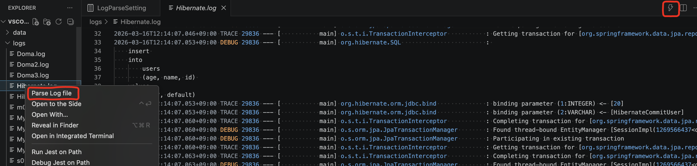
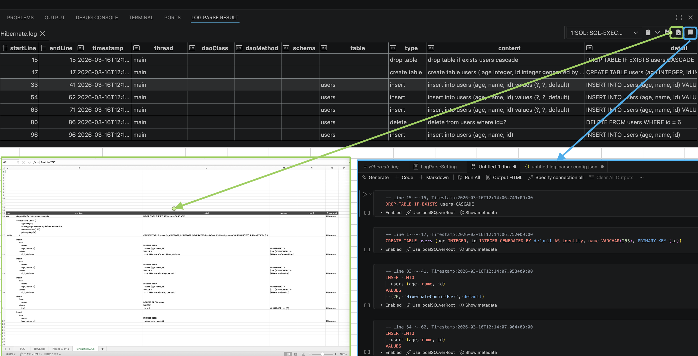

# Log Parser Usage Guide

This document explains how to use the `Log Parser` feature and how it works internally.

---

## Overview

This extension parses application logs (e.g. Spring Boot + Hibernate) and extracts structured SQL execution data.

### Processing Pipeline

```
split → (expand message) → classify → extract → build-sql
```

| Step | Description |
|------|------------|
| split | Raw log is divided into logical log events |
| expand message | Expand a single log event containing multiple logical messages into multiple events, duplicating metadata so each can be classified independently |
| classify | Each event is classified (SQL, TX, NORMAL, etc.) |
| extract | SQL statements, parameters, and metadata are extracted |
| build-sql | Final SQL is reconstructed with bound parameters |

---

## Usage Flow

### 1. Open the Log Parse Settings Panel



- Open the folder containing your logs and config files in VS Code.
- Open a log file in the editor, then right-click → **Parse Log file**.
- The **LogParseSetting** panel opens with guidance, a **Config file** selector, and **a) RAW LOG**.

### 2. Select or Create a Config

For a known log format, select its `*.log-parser.config.json` file from **Config file**. Previews run automatically using the available settings. You do not need to apply presets again or repeat setup steps.

For a new log format, click **Create new config** in the top-right toolbar and save a file ending in `.log-parser.config.json` in your workspace. The empty config is selected automatically; continue with the presets in step 4.

To adapt an existing config while preserving the original, select it and click **Copy config and adjust** below the selector. Choose a different file name; subsequent changes apply to the copy.

### 3. Choose the Preview Sample

In **a) RAW LOG**, the row above the table shows the total number of lines and the **Test sample** dropdown.

- Logs with **500 lines or fewer** start with **All**.
- Larger logs start with **First 500 lines**.
- Change the sample to inspect more or fewer lines. All preview stages use this sample, and update automatically.

Preview tables scroll and are not limited to 10 rows. Sampling affects previews only; **Parse all log** always processes the entire log.

### 4. Configure Splitting and SQL Extraction

**b) SPLIT & CLASSIFIED LOG** appears when a config is selected, including a newly created empty config.

1. Choose a **Log split preset** and click its **Apply** button. Review the automatically generated log events, especially event boundaries and multiline messages.
2. Once the split settings are valid, choose a **SQL output preset (classify & extract)** and click **Apply**. Review the classified events and the SQL preview in **c)**.

The split preset and its current split/field patterns appear on the left; the SQL output preset and current classification rules appear on the right. On narrow panels, these columns stack vertically. **Selected preset details** lets you inspect a preset before applying it.

**Likely**, **Detected**, and **Recommended** are detection hints, not automatically applied settings. SQL preset detection uses the split events and updates after the preview runs.

Applying a split preset replaces the config's `split` settings. Applying a SQL output preset replaces `classify` and `extractors`. Copy the config first if you want to preserve custom rules.

There are no separate test buttons or confirmation steps. The config determines how far the automatic preview can run:

| Valid settings | Automatic preview | Parse all log |
| --- | --- | --- |
| No config or empty split settings | Raw log only; an empty config also shows the controls in b) | Hidden |
| Split | Split events in b) | Hidden |
| Split and classification | Classified events in b) | Hidden |
| Split, classification, and extraction | Classified events in b) and SQL in c) | Shown |

### 5. Review and Fine-Tune the Config

**c) EXTRACT & FORMAT SQL** appears when the config is valid for SQL extraction. It shows the optional **SQL formatter language**, the current **SQL extraction settings**, and extracted SQL. Choosing a formatter is not required for parsing.

Use **Edit JSON** in the top-right toolbar to open the config beside the panel. This is useful for rules that presets cannot express, fine-tuning patterns, or combining rules from other configs. Previews use the current editor contents, including unsaved changes.

| Action | Preview behavior |
| --- | --- |
| Select a config or create/copy one | Runs automatically up to the highest valid stage |
| Apply either preset | Updates automatically |
| Change Test sample or SQL formatter language | Updates automatically without changing the config rules |
| Edit the selected config JSON | Updates about one second after the last edit |
| Save config | Saves changes; does not run a full-log parse |

During updates, a spinner and status message indicate that previous results may still be displayed. Check the guidance for invalid settings or errors. If field extraction fails for some events, expand the diagnostic message to see their start lines.

If no SQL is found, increase **Test sample** or select **All** before changing rules: the sample may simply contain no SQL. A zero-result preview does not hide **Parse all log** when the config is valid.

The source log is read when the panel opens. If the log file changes, close and reopen the panel to load it again.

### 6. Save the Config and Parse the Entire Log

The top-right toolbar contains:

| Button | When shown | Action |
| --- | --- | --- |
| Create new config | No config selected | Creates and selects an empty config |
| Edit JSON | Config selected | Opens the config in an adjacent editor |
| Save config | Config has unsaved changes | Saves the config without parsing the entire log |
| Parse all log | Config is valid for SQL extraction | Parses all log lines using the current settings, including unsaved edits |
| × | Always | Closes the panel |

**Parse all log does not save the config.** Use **Save config** or the editor's save command to keep your changes. VS Code Auto Save also applies to config edits.

After parsing, open the **Log Parse Result** view → the **tab named after your log file** → the **table selector at the top right**, and choose the entry containing **SQL-EXECUTION**. The completion message also gives this location. The view's position depends on your VS Code layout.

Automatic previews stay inside the settings panel. Only **Parse all log** sends results to the **Log Parse Result** view. Each of the a), b), and c) sections can be collapsed independently.

### 7. Export Results

In **Log Parse Result**, use **Output as Excel** to create a report or **Open in NoteBook** to open the SQL in a database notebook. Hover over the toolbar icons to see these names.



---

## Example Result

Sample `SpringBoot x Hibernate` log

### 1. RAW LOG

```log
2026-03-16T12:14:07.045+09:00  INFO 29836 --- [           main] com.example.demo.DemoApplication         : ===== HIBERNATE COMMIT TEST =====
2026-03-16T12:14:07.045+09:00 DEBUG 29836 --- [           main] o.s.orm.jpa.JpaTransactionManager        : Creating new transaction with name [com.example.demo.HibernateService.commitTransactionTest]: PROPAGATION_REQUIRED,ISOLATION_DEFAULT
2026-03-16T12:14:07.045+09:00 DEBUG 29836 --- [           main] o.s.orm.jpa.JpaTransactionManager        : Opened new EntityManager [SessionImpl(1269566437<open>)] for JPA transaction
2026-03-16T12:14:07.045+09:00 DEBUG 29836 --- [           main] o.s.orm.jpa.JpaTransactionManager        : Exposing JPA transaction as JDBC [org.springframework.orm.jpa.vendor.HibernateJpaDialect$HibernateConnectionHandle@368d51ca]
2026-03-16T12:14:07.066+09:00 TRACE 29836 --- [           main] o.s.t.i.TransactionInterceptor           : Getting transaction for [org.springframework.data.jpa.repository.support.SimpleJpaRepository.delete]
2026-03-16T12:14:07.067+09:00 TRACE 29836 --- [           main] o.s.t.i.TransactionInterceptor           : Completing transaction for [org.springframework.data.jpa.repository.support.SimpleJpaRepository.delete]
2026-03-16T12:14:07.067+09:00 TRACE 29836 --- [           main] o.s.t.i.TransactionInterceptor           : Completing transaction for [com.example.demo.HibernateService.commitTransactionTest]
2026-03-16T12:14:07.067+09:00 DEBUG 29836 --- [           main] o.s.orm.jpa.JpaTransactionManager        : Initiating transaction commit
2026-03-16T12:14:07.067+09:00 DEBUG 29836 --- [           main] o.s.orm.jpa.JpaTransactionManager        : Committing JPA transaction on EntityManager [SessionImpl(1269566437<open>)]
2026-03-16T12:14:07.070+09:00 DEBUG 29836 --- [           main] org.hibernate.SQL                        : 
    delete 
    from
        users 
    where
        id=?
2026-03-16T12:14:07.070+09:00 TRACE 29836 --- [           main] org.hibernate.orm.jdbc.bind              : binding parameter (1:INTEGER) <- [6]
2026-03-16T12:14:07.071+09:00 DEBUG 29836 --- [           main] o.s.orm.jpa.JpaTransactionManager        : Closing JPA EntityManager [SessionImpl(1269566437<open>)] after transaction
2026-03-16T12:14:07.071+09:00  INFO 29836 --- [           main] com.example.demo.DemoApplication         : ===== HIBERNATE ROLLBACK TEST =====
2026-03-16T12:14:07.071+09:00 DEBUG 29836 --- [           main] o.s.orm.jpa.JpaTransactionManager        : Creating new transaction with name [com.example.demo.HibernateService.rollbackTransactionTest]: PROPAGATION_REQUIRED,ISOLATION_DEFAULT
2026-03-16T12:14:07.071+09:00 DEBUG 29836 --- [           main] o.s.orm.jpa.JpaTransactionManager        : Opened new EntityManager [SessionImpl(670244241<open>)] for JPA transaction
2026-03-16T12:14:07.071+09:00 DEBUG 29836 --- [           main] o.s.orm.jpa.JpaTransactionManager        : Exposing JPA transaction as JDBC [org.springframework.orm.jpa.vendor.HibernateJpaDialect$HibernateConnectionHandle@6b03c35c]
2026-03-16T12:14:07.071+09:00 TRACE 29836 --- [           main] o.s.t.i.TransactionInterceptor           : Getting transaction for [com.example.demo.HibernateService.rollbackTransactionTest]
2026-03-16T12:14:07.071+09:00 DEBUG 29836 --- [           main] o.s.orm.jpa.JpaTransactionManager        : Found thread-bound EntityManager [SessionImpl(670244241<open>)] for JPA transaction
2026-03-16T12:14:07.071+09:00 DEBUG 29836 --- [           main] o.s.orm.jpa.JpaTransactionManager        : Participating in existing transaction
2026-03-16T12:14:07.071+09:00 TRACE 29836 --- [           main] o.s.t.i.TransactionInterceptor           : Getting transaction for [org.springframework.data.jpa.repository.support.SimpleJpaRepository.save]
2026-03-16T12:14:07.071+09:00 DEBUG 29836 --- [           main] org.hibernate.SQL                        : 
    insert 
    into
        users
        (age, name, id) 
    values
        (?, ?, default)
2026-03-16T12:14:07.072+09:00 TRACE 29836 --- [           main] org.hibernate.orm.jdbc.bind              : binding parameter (1:INTEGER) <- [null]
2026-03-16T12:14:07.072+09:00 TRACE 29836 --- [           main] org.hibernate.orm.jdbc.bind              : binding parameter (2:VARCHAR) <- [HibernateRollbackUser]
2026-03-16T12:14:07.072+09:00 TRACE 29836 --- [           main] o.s.t.i.TransactionInterceptor           : Completing transaction for [org.springframework.data.jpa.repository.support.SimpleJpaRepository.save]
2026-03-16T12:14:07.072+09:00 TRACE 29836 --- [           main] o.s.t.i.TransactionInterceptor           : Completing transaction for [com.example.demo.HibernateService.rollbackTransactionTest] after exception: java.lang.RuntimeException: Hibernate rollback test
2026-03-16T12:14:07.072+09:00 DEBUG 29836 --- [           main] o.s.orm.jpa.JpaTransactionManager        : Initiating transaction rollback
2026-03-16T12:14:07.072+09:00 DEBUG 29836 --- [           main] o.s.orm.jpa.JpaTransactionManager        : Rolling back JPA transaction on EntityManager [SessionImpl(670244241<open>)]
2026-03-16T12:14:07.072+09:00 DEBUG 29836 --- [           main] o.s.orm.jpa.JpaTransactionManager        : Closing JPA EntityManager [SessionImpl(670244241<open>)] after transaction

```

---

### 2. Classified

| lineNo | eventType | timestamp | thread | level | logger | transformed | message | pid |
| ---: | :--- | :--- | :--- | :--- | :--- | :--- | :--- | :--- |
| INTEGER | TEXT | TEXT | TEXT | ENUM | TEXT | TEXT | TEXT | TEXT |
| 1 | NORMAL | 2026-03-16T12:14:07.045+09:00 | main | INFO | com.example.demo.DemoApplication | `NULL` | ===== HIBERNATE COMMIT TEST ===== | 29836 |
| 2 | TX_BEGIN | 2026-03-16T12:14:07.045+09:00 | main | DEBUG | o.s.orm.jpa.JpaTransactionManager | `NULL` | Creating new transaction with name [com.example.demo.HibernateService.commitTransactionTest]: PROPAGATION_REQUIRED,ISOLATION_DEFAULT | 29836 |
| 3 | NORMAL | 2026-03-16T12:14:07.045+09:00 | main | DEBUG | o.s.orm.jpa.JpaTransactionManager | `NULL` | Opened new EntityManager [SessionImpl(1269566437&lt;open&gt;)] for JPA transaction | 29836 |
| 4 | NORMAL | 2026-03-16T12:14:07.045+09:00 | main | DEBUG | o.s.orm.jpa.JpaTransactionManager | `NULL` | Exposing JPA transaction as JDBC [org.springframework.orm.jpa.vendor.HibernateJpaDialect$HibernateConnectionHandle@368d51ca] | 29836 |
| 5 | TX_METHOD_ENTER | 2026-03-16T12:14:07.066+09:00 | main | TRACE | o.s.t.i.TransactionInterceptor | `NULL` | Getting transaction for [org.springframework.data.jpa.repository.support.SimpleJpaRepository.delete] | 29836 |
| 6 | TX_METHOD_EXIT | 2026-03-16T12:14:07.067+09:00 | main | TRACE | o.s.t.i.TransactionInterceptor | `NULL` | Completing transaction for [org.springframework.data.jpa.repository.support.SimpleJpaRepository.delete] | 29836 |
| 7 | TX_METHOD_EXIT | 2026-03-16T12:14:07.067+09:00 | main | TRACE | o.s.t.i.TransactionInterceptor | `NULL` | Completing transaction for [com.example.demo.HibernateService.commitTransactionTest] | 29836 |
| 8 | TX_COMMIT | 2026-03-16T12:14:07.067+09:00 | main | DEBUG | o.s.orm.jpa.JpaTransactionManager | `NULL` | Initiating transaction commit | 29836 |
| 9 | NORMAL | 2026-03-16T12:14:07.067+09:00 | main | DEBUG | o.s.orm.jpa.JpaTransactionManager | `NULL` | Committing JPA transaction on EntityManager [SessionImpl(1269566437&lt;open&gt;)] | 29836 |
| 10 | SQL_START | 2026-03-16T12:14:07.070+09:00 | main | DEBUG | org.hibernate.SQL | `NULL` | delete <br>&emsp;&emsp;from<br>&emsp;&emsp;&emsp;&emsp;users <br>&emsp;&emsp;where<br>&emsp;&emsp;&emsp;&emsp;id=? | 29836 |
| 16 | SQL_PARAMS | 2026-03-16T12:14:07.070+09:00 | main | TRACE | org.hibernate.orm.jdbc.bind | (1:INTEGER) &lt;- [6] | binding parameter (1:INTEGER) &lt;- [6] | 29836 |
| 17 | NORMAL | 2026-03-16T12:14:07.071+09:00 | main | DEBUG | o.s.orm.jpa.JpaTransactionManager | `NULL` | Closing JPA EntityManager [SessionImpl(1269566437&lt;open&gt;)] after transaction | 29836 |
| 18 | NORMAL | 2026-03-16T12:14:07.071+09:00 | main | INFO | com.example.demo.DemoApplication | `NULL` | ===== HIBERNATE ROLLBACK TEST ===== | 29836 |
| 19 | TX_BEGIN | 2026-03-16T12:14:07.071+09:00 | main | DEBUG | o.s.orm.jpa.JpaTransactionManager | `NULL` | Creating new transaction with name [com.example.demo.HibernateService.rollbackTransactionTest]: PROPAGATION_REQUIRED,ISOLATION_DEFAULT | 29836 |
| 20 | NORMAL | 2026-03-16T12:14:07.071+09:00 | main | DEBUG | o.s.orm.jpa.JpaTransactionManager | `NULL` | Opened new EntityManager [SessionImpl(670244241&lt;open&gt;)] for JPA transaction | 29836 |
| 21 | NORMAL | 2026-03-16T12:14:07.071+09:00 | main | DEBUG | o.s.orm.jpa.JpaTransactionManager | `NULL` | Exposing JPA transaction as JDBC [org.springframework.orm.jpa.vendor.HibernateJpaDialect$HibernateConnectionHandle@6b03c35c] | 29836 |
| 22 | TX_METHOD_ENTER | 2026-03-16T12:14:07.071+09:00 | main | TRACE | o.s.t.i.TransactionInterceptor | `NULL` | Getting transaction for [com.example.demo.HibernateService.rollbackTransactionTest] | 29836 |
| 23 | NORMAL | 2026-03-16T12:14:07.071+09:00 | main | DEBUG | o.s.orm.jpa.JpaTransactionManager | `NULL` | Found thread-bound EntityManager [SessionImpl(670244241&lt;open&gt;)] for JPA transaction | 29836 |
| 24 | NORMAL | 2026-03-16T12:14:07.071+09:00 | main | DEBUG | o.s.orm.jpa.JpaTransactionManager | `NULL` | Participating in existing transaction | 29836 |
| 25 | TX_METHOD_ENTER | 2026-03-16T12:14:07.071+09:00 | main | TRACE | o.s.t.i.TransactionInterceptor | `NULL` | Getting transaction for [org.springframework.data.jpa.repository.support.SimpleJpaRepository.save] | 29836 |
| 26 | SQL_START | 2026-03-16T12:14:07.071+09:00 | main | DEBUG | org.hibernate.SQL | `NULL` | insert <br>&emsp;&emsp;into<br>&emsp;&emsp;&emsp;&emsp;users<br>&emsp;&emsp;&emsp;&emsp;(age, name, id) <br>&emsp;&emsp;values<br>&emsp;&emsp;&emsp;&emsp;(?, ?, default) | 29836 |
| 33 | SQL_PARAMS | 2026-03-16T12:14:07.072+09:00 | main | TRACE | org.hibernate.orm.jdbc.bind | (1:INTEGER) &lt;- [null] | binding parameter (1:INTEGER) &lt;- [null] | 29836 |
| 34 | SQL_PARAMS | 2026-03-16T12:14:07.072+09:00 | main | TRACE | org.hibernate.orm.jdbc.bind | (2:VARCHAR) &lt;- [HibernateRollbackUser] | binding parameter (2:VARCHAR) &lt;- [HibernateRollbackUser] | 29836 |
| 35 | TX_METHOD_EXIT | 2026-03-16T12:14:07.072+09:00 | main | TRACE | o.s.t.i.TransactionInterceptor | `NULL` | Completing transaction for [org.springframework.data.jpa.repository.support.SimpleJpaRepository.save] | 29836 |
| 36 | TX_METHOD_EXIT | 2026-03-16T12:14:07.072+09:00 | main | TRACE | o.s.t.i.TransactionInterceptor | `NULL` | Completing transaction for [com.example.demo.HibernateService.rollbackTransactionTest] after exception: java.lang.RuntimeException: Hibernate rollback test | 29836 |
| 37 | TX_ROLLBACK | 2026-03-16T12:14:07.072+09:00 | main | DEBUG | o.s.orm.jpa.JpaTransactionManager | `NULL` | Initiating transaction rollback | 29836 |
| 38 | NORMAL | 2026-03-16T12:14:07.072+09:00 | main | DEBUG | o.s.orm.jpa.JpaTransactionManager | `NULL` | Rolling back JPA transaction on EntityManager [SessionImpl(670244241&lt;open&gt;)] | 29836 |
| 39 | NORMAL | 2026-03-16T12:14:07.072+09:00 | main | DEBUG | o.s.orm.jpa.JpaTransactionManager | `NULL` | Closing JPA EntityManager [SessionImpl(670244241&lt;open&gt;)] after transaction<br> | 29836 |

---

### 3. Extracted SQL

| startLine | endLine | timestamp | thread | daoClass | daoMethod | schema | table | type | content | detail | params | result | framework |
| ---: | ---: | :--- | :--- | :--- | :--- | :--- | :--- | :--- | :--- | :--- | :--- | :--- | :--- |
| INTEGER | INTEGER | TEXT | TEXT | TEXT | TEXT | TEXT | TEXT | TEXT | TEXT | TEXT | TEXT | TEXT | TEXT |
| 10 | 16 | 2026-03-16T12:14:07.070+09:00 | main | `NULL` | `NULL` | `NULL` | users | delete | delete <br>&emsp;&emsp;from<br>&emsp;&emsp;&emsp;&emsp;users <br>&emsp;&emsp;where<br>&emsp;&emsp;&emsp;&emsp;id=? | DELETE FROM users<br>WHERE<br>&emsp;id = 6 | (1:INTEGER) &lt;- [6] | `NULL` | Hibernate |
| 26 | 34 | 2026-03-16T12:14:07.071+09:00 | main | `NULL` | `NULL` | `NULL` | users | insert | insert <br>&emsp;&emsp;into<br>&emsp;&emsp;&emsp;&emsp;users<br>&emsp;&emsp;&emsp;&emsp;(age, name, id) <br>&emsp;&emsp;values<br>&emsp;&emsp;&emsp;&emsp;(?, ?, default) | INSERT INTO<br>&emsp;users (age, name, id)<br>VALUES<br>&emsp;(NULL, 'HibernateRollbackUser', default) | (1:INTEGER) &lt;- [null],(2:VARCHAR) &lt;- [HibernateRollbackUser] | `NULL` | Hibernate |

---


## Internal Architecture

```
Raw Log
  ↓
[Split]
  ↓
[Expand Message]
  ↓
[Classify Events]
  ↓
[Extract SQL + Params]
  ↓
[Build SQL]
  ↓
[Output]
```

---

## Summary

- Configurable log parsing
- Preset-driven design
- Supports multiple frameworks
